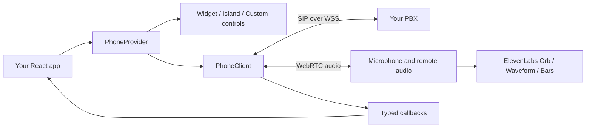

<p align="center">
  
</p>

# Azeer React Phone

A customizable SIP phone for React. Embed a complete widget, dock a **dynamic island**, or compose your own calling controls. Powered by **JsSIP** and source adaptations of **ElevenLabs UI** Orb, Live Waveform, and Bar Visualizer.

**[Documentation](https://alshell7.github.io/react-phone/) · [Playground](https://alshell7.github.io/react-phone/playground/) · [JSR package](https://jsr.io/@azeer-ui-widget/react-phone) · [Releases](https://github.com/alshell7/react-phone/releases)**

[](./LICENSE)
[](https://react.dev/)
[](https://jsr.io/@azeer-ui-widget/react-phone/doc)
[](https://github.com/alshell7/react-phone/actions/workflows/check.yml)

## See it in action


<p align="center">
  
  &nbsp;&nbsp;
  
</p>

Screenshots use simulated calls. The hosted playground opens in **Preview** mode; switch to **Live SIP** to connect an account.

## What ships

| Calling                                    | Interface                               | Integration                            |
| ------------------------------------------ | --------------------------------------- | -------------------------------------- |
| Incoming / outgoing audio                  | Basic, advanced, compact presets        | React 19 + TypeScript                  |
| Mute, hold/resume, DTMF                    | Dynamic island with six dock positions  | Complete components or headless client |
| Blind transfer with REFER outcome handling | Orb, waveform, bars, avatar             | Typed lifecycle callbacks              |
| Permission, reconnect, and media recovery  | Themes, caller identity, tags, branding | Scoped CSS; no Tailwind setup          |
| Manual, prefilled, or automatic dialing    | Configurable tones, controls, motion    | MIT; published as source on JSR        |

**One audio call per client.** A second INVITE receives `486 Busy Here`. Transfer needs PBX REFER support. Attended transfer, conferencing, recording, and emergency calling are outside this release.

## Install and embed

Requires React 19. Use package version **0.1.2 or later** for npm-compatible installs with strict TypeScript declarations.

```sh
npx jsr add @azeer-ui-widget/react-phone
```

```tsx
import { WebPhone, type SipConfig } from "@azeer-ui-widget/react-phone";

// Supply a stable config from your sign-in flow. Keep credentials in memory.
export function SupportPhone({ config }: { config: SipConfig }) {
  return (
    <WebPhone
      config={config}
      autoConnect
      preset="advanced"
      theme={{ appearance: "dark", accent: "#91edc2" }}
      visualization={{ type: "orb" }}
      onAnswered={(call) => console.info("Answered", call.id)}
      onDisconnected={(call) => console.info("Ended", call.endReason)}
    />
  );
}
```

`autoConnect` defaults to false. Memoize `config` or keep it in state: replacing it intentionally reconnects. Use a client component in SSR frameworks. Microphone access is requested on dial/answer; permission denial and blocked audio have recovery UI. No ElevenLabs API key is needed.

**[Complete setup](https://alshell7.github.io/react-phone/quick-start/) · [SIP configuration](https://alshell7.github.io/react-phone/sip-configuration/)**

## A phone that becomes an island


```tsx
import { WebPhoneIsland } from "@azeer-ui-widget/react-phone";

<WebPhoneIsland
  config={config}
  autoConnect
  placement="bottom-right"
  scope="window"
  offset={20}
  incomingBehavior="notify"
  visualization={{ type: "orb" }}
/>;
```

| Incoming behavior | Result                                               |
| ----------------- | ---------------------------------------------------- |
| `expand`          | Open the full phone on a new incoming call (default) |
| `notify`          | Show compact caller, Answer, and Decline controls    |
| `manual`          | Keep the island collapsed; user opens it to answer   |

Connection status stays visible. Collapsing never disconnects or ends a call. Use `scope="container"` inside a positioned parent with a height. Placement supports top/bottom × left/center/right. Focus remains with the user unless `focusOnIncoming` is enabled.

**[Positioning, controlled expansion, and behavior options](https://alshell7.github.io/react-phone/dynamic-island/)**

## Manual or automatic calls

```tsx
// Prefill only; the user still presses Call.
<WebPhone config={config} autoConnect defaultNumber="7003" />

// One attempt after registration. A new key intentionally permits a new attempt.
<WebPhone
  config={config}
  autoConnect
  defaultNumber="7003"
  autoDial
  autoDialKey="support-request-42"
/>
```

Each destination/key gets one attempt per mounted widget and client. Reconnects, rerenders, hangup, and microphone denial do not redial. Busy-line requests are skipped. Unmounting resets this scope. **[Calling contract](https://alshell7.github.io/react-phone/calling/)**

## Architecture



| Customize                                                  | Read                                                                       |
| ---------------------------------------------------------- | -------------------------------------------------------------------------- |
| Caller name, number, avatar, tags, render slots, colors    | [Themes & identity](https://alshell7.github.io/react-phone/customization/) |
| Orb colors/speed, waveform mode/source, frequency bars     | [Audio visuals](https://alshell7.github.io/react-phone/visuals/)           |
| Independent dialer, transfer control, headless state       | [Composable API](https://alshell7.github.io/react-phone/components/)       |
| Ringing, keypad feedback, branding, drag, reduced motion   | [Sound & motion](https://alshell7.github.io/react-phone/sound-and-motion/) |
| Answered/disconnected events and state diagrams            | [Lifecycle](https://alshell7.github.io/react-phone/events/)                |
| Microphone, autoplay, iframe, network, and device failures | [Recovery](https://alshell7.github.io/react-phone/recovery/)               |

## Develop locally

Requires Node.js 24+ for the documentation toolchain and a current WebRTC browser.

```sh
npm ci
npm run dev                 # React playground at http://127.0.0.1:5173
npm ci --prefix docs
npm run docs:dev            # Starlight at http://localhost:4321/react-phone/
```

For live testing, enter the SIP username and password in **Live SIP → Connection**. Credentials are held in memory and excluded from generated embed code. Do not put SIP passwords in public build-time environment variables. [Connection setup](https://alshell7.github.io/react-phone/playground-guide/#connect-your-sip-account) explains how to supply your own account; all Live SIP fields start empty.

```sh
npm run package:build       # Refresh publish/ after changing src/
npm run check
npx playwright install chromium
npm run test:e2e
npm run site:build
npx jsr publish --dry-run --allow-dirty
```

The suite covers lifecycle races, two actual JsSIP clients with local WebRTC audio, desktop/mobile UI, and accessibility. Production PBX routing, TURN, and transfers still need an end-to-end call on your deployment. See [VALIDATION.md](./VALIDATION.md).

## Publishing

The supplied [Publish workflow](https://github.com/alshell7/react-phone/blob/main/.github/workflows/publish.yml) runs `npx jsr publish` on pushes to `main`, using the linked repository's OIDC identity. Edit `src/` and run `npm run package:build`; commit the generated JSX-free TypeScript in `publish/` so JSR's npm bridge can emit standard JavaScript. CI checks that it matches the source. Keep `package.json` and `jsr.json` versions aligned; JSR versions are immutable. The [Pages workflow](https://github.com/alshell7/react-phone/blob/main/.github/workflows/pages.yml) deploys Starlight and the playground together. **[Release workflow and site build](https://alshell7.github.io/react-phone/development/)**

## License and credits

[MIT © 2026 Owais](./LICENSE). [ElevenLabs UI](https://ui.elevenlabs.io/) supplies the adapted audio visuals; [JsSIP](https://jssip.net/) handles SIP/WebRTC. [react-softphone](https://github.com/chamuridis/react-softphone) informed the architecture. Full attribution and adaptation details are in [THIRD_PARTY_NOTICES.md](./THIRD_PARTY_NOTICES.md).
