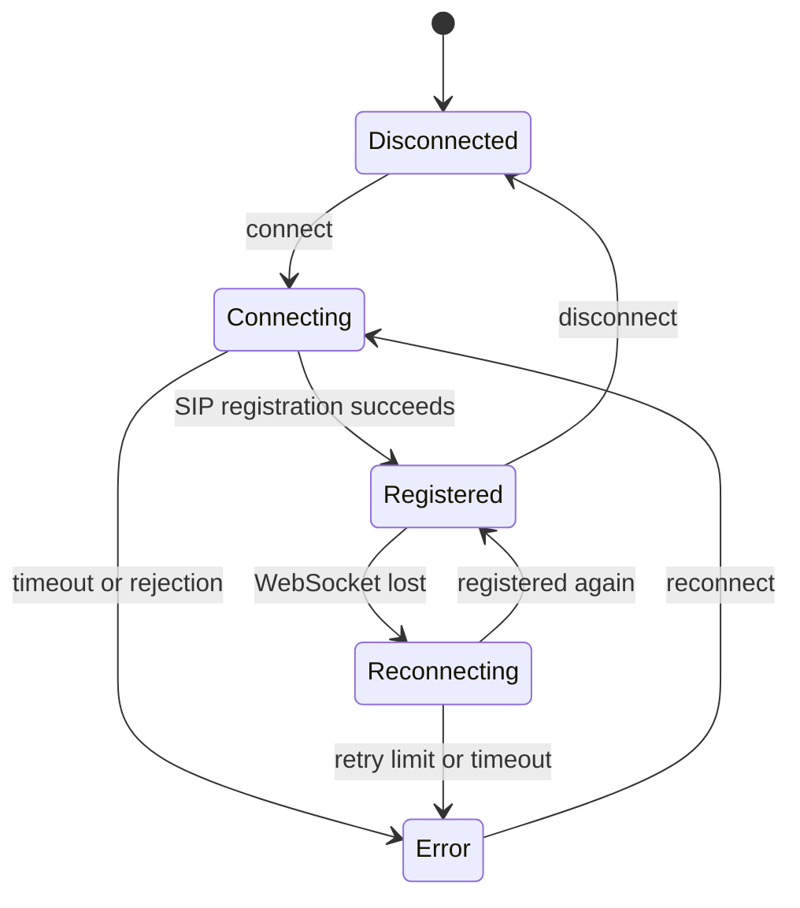
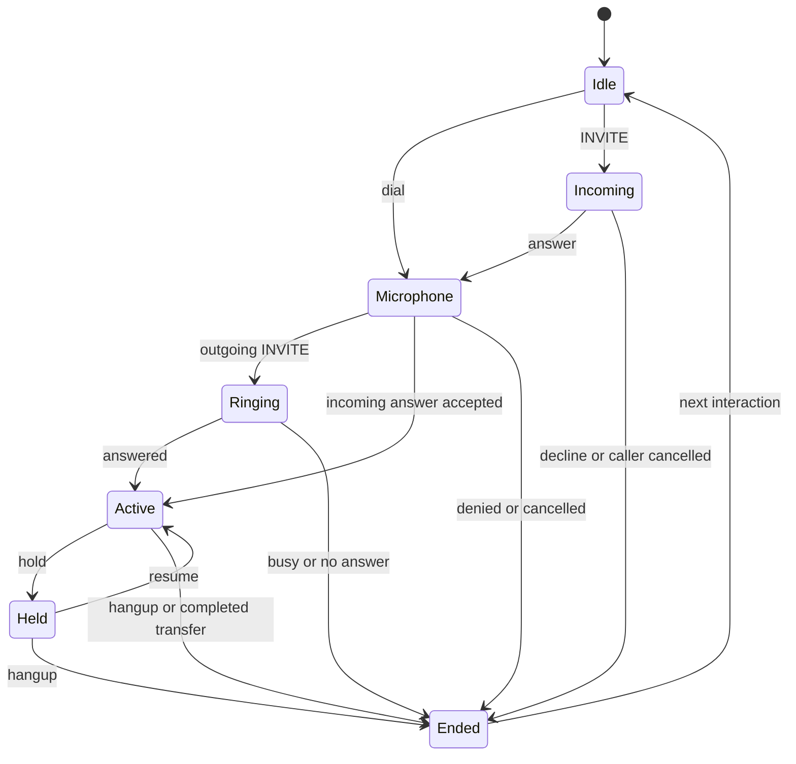

Connection and call state are independent. A connected account can be idle, ringing, or in a call.

## Connection state

Mermaid source

## Call state

Mermaid source

The client retains `ended` until the next call starts, keeping its outcome available to the UI. Connection and call state are independent.

## Callbacks

| Callback                     | When                                                       |
| ---------------------------- | ---------------------------------------------------------- |
| `onIncomingCall(call)`       | A new incoming call is accepted by the local line          |
| `onAnswered(call)`           | The call is answered/attended; exactly once                |
| `onDisconnected(call)`       | A call ends, including failures/cancellation; exactly once |
| `onConnectionChange(status)` | Registration / transport state changes                     |
| `onError(error)`             | Actionable sanitized error                                 |
| `onEvent(event)`             | All lifecycle events below                                 |

Event types: `connection`, `incoming`, `outgoing`, `answered`, `disconnected`, `muted`, `held`, `dtmf`, `transfer-started`, `transferred`, `error`. Payload: `{ type, timestamp, call, connection, error?, value? }`. Call data includes ID, direction, caller, start/answer/end timestamps, and end reason. It never includes passwords, complete SIP requests, or raw server responses. In-memory demo history/logs can contain phone numbers; apply your own retention policy in a host application.
